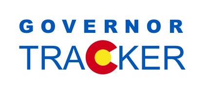

In 2018, the state of Colorado will be electing a new governor. As the election heats up, it's important for voters to know where candidates are getting their campaign contribution. Colorado Governor Tracker takes the public data gathered by campaigns and makes it accessible to the average voter throught graphs, maps and other visual representations of the data. 

### Tech Stack:
Front-End: React.js, Redux, Router
Back-End: Node.js, psql, Express
Graphs: D3, Victory

This project was a self directed project built by @mariastlouis and @jdursema. It was built in 3 weeks; however, the developers continue to work on it.

[Checkout the Live Site!](https://governortrackerco.herokuapp.com/)
